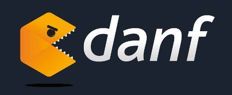

===========================

[![NPM Version][npm-image]][npm-url]
[![NPM Downloads][downloads-image]][downloads-url]
[![Build Status][travis-image]][travis-url]

Introduction
------------

###Another Javascript/NodeJS framework??

Yes!

###Why?

The main goal of this full-stack framework is to help you organize, rationalize and homogenize your javascript code (website, api, ...) on both the server (nodejs) and client (browser) sides.

###Which features of this framework can help me to realize that?

Danf provides many features in order to produce an scalable, maintainable, testable and performant code:
* An object-oriented programming layer.
* An inversion of control design (dependency injection via configurations files).
* A simple system allowing to use the same code on both the client and server sides.
* A homogeneous way to handle all kind of events (http request, DOM events, ...).
* An elegant solution to callback hell preserving asynchronicity.
* A helper to develop performant ajax applications supporting deep linking.
* A modular approach to develop and use (open source) modules.
* Some other helpful sub features to easily manage cookies, session, ...

###What?? An object-oriented programming layer?

Object-oriented programming (OOP) is often a controversial topic in the javascript community. Most of the time, you can observe two reactions:
* - But everything is already object in javascript!
* - Why the hell do you want to use OOP in javascript?

First, that is not because all variables are objects that a langage can be considered as providing a way to make a straightforward and robust OOP. As for now, native javascript does not allow to make a reliable industrial OOP code (this will be explained in the concept section of the documentation).
Then, OOP is certainly not a matter of language, but rather a means of architecturing applications. So why not use OOP for a javascript application?

###So, OOP is the way to develop in javascript?

No. It is one possible way.

Hello world
-----------

```javascript
// app.js

var danf = require('danf');

danf({
    config: {
        events: {
            request: {
                helloWorld: {
                    path: '/',
                    methods: ['get'],
                    view: {
                        text: {
                            value: 'Hello world!'
                        }
                    }
                }
            }
        }
    }
});
```

Installation
------------

```sh
$ npm install -g danf
```

Community
---------

Danf is a brand new framework. It may seem a little hard to handle at the beginning but it can help you to master big projects by avoiding the divergence of the complexity as well as smaller fast and dynamic websites. Just give it a try on one of your project or by testing the tutorial accessible in the [documentation](doc/index.md). Be careful, you could see your way of coding javascript in Node forever change (or not...).

Of course, the community is still small, but it is an active community. You can post your issues on [github](https://github.com/gnodi/danf/issues) or on [stack overflow](http://stackoverflow.com/) with the tag `danf` and you will get an answer as fast as possible.

> `<trailer-voice>`Have you ever wanted to participate in the early stages of a new technology? Let's try it on Danf! Join the community and contribute now.`</trailer-voice>`

Documentation
-------------

You can access a full documentation [here](doc/index.md).

License
-------

Open Source Initiative OSI - The MIT License

http://www.opensource.org/licenses/mit-license.php

Copyright (c) 2014 Thomas Prelot

Permission is hereby granted, free of charge, to any person obtaining
a copy of this software and associated documentation files (the
"Software"), to deal in the Software without restriction, including
without limitation the rights to use, copy, modify, merge, publish,
distribute, sublicense, and/or sell copies of the Software, and to
permit persons to whom the Software is furnished to do so, subject to
the following conditions:

The above copyright notice and this permission notice shall be
included in all copies or substantial portions of the Software.

THE SOFTWARE IS PROVIDED "AS IS", WITHOUT WARRANTY OF ANY KIND,
EXPRESS OR IMPLIED, INCLUDING BUT NOT LIMITED TO THE WARRANTIES OF
MERCHANTABILITY, FITNESS FOR A PARTICULAR PURPOSE AND
NONINFRINGEMENT. IN NO EVENT SHALL THE AUTHORS OR COPYRIGHT HOLDERS BE
LIABLE FOR ANY CLAIM, DAMAGES OR OTHER LIABILITY, WHETHER IN AN ACTION
OF CONTRACT, TORT OR OTHERWISE, ARISING FROM, OUT OF OR IN CONNECTION
WITH THE SOFTWARE OR THE USE OR OTHER DEALINGS IN THE SOFTWARE.

[npm-image]: https://img.shields.io/npm/v/danf.svg?style=flat
[npm-url]: https://npmjs.org/package/danf
[downloads-image]: https://img.shields.io/npm/dm/danf.svg?style=flat
[downloads-url]: https://npmjs.org/package/danf
[travis-image]: https://img.shields.io/travis/gnodi/danf.svg?style=flat
[travis-url]: https://travis-ci.org/gnodi/danf