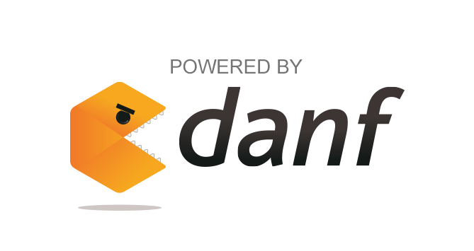

Danf Documentation
==================

[←](../README.md)

Danf is a javascript/node framework providing many features in order to produce an evolutionary, maintainable, testable and performant code:
* An object-oriented programming layer.
* An inversion of control design (dependency injection via configurations files).
* A simple system allowing to use the same code on both the client and server sides.
* A homogeneous way to handle all kind of events (http request, dom events, ...).
* An elegant solution to callback hell preserving asynchronicity.
* A helper to develop performant ajax applications supporting deep linking.
* A modular approach to develop and use (open source) modules.

Understand
----------

Let's understand the main [concepts](concepts.md) that guided the developement of Danf.

Learn
-----

You have 3 possible axes to learn more things about Danf:

* [Test the framework](test/index.md): apply a concrete example.
* [Use the framework](use/index.md): consult the use documentation.
* [Customize the framework](customize/index.md): make your own framework.

Each section of Test has a related section in Use and each section of Customize belongs to one of these sections. Thus, you can easily navigate inside axes and/or inside sections.

Contribute
----------

Danf is a really young framework and may be unstable and/or incomplete. But you can help to make it better! Fork it on github and feel free to improve it or to correct this documentation (is it really English?)!

[←](../README.md)

  